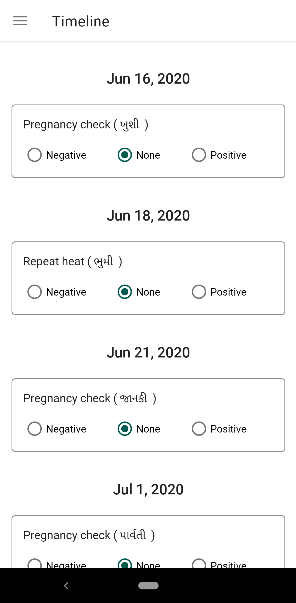

# Cattle Notes

   

Provides an all-in-one-place for efficient monitoring of a cattle farm, and assists farmers to easily
track the breeding activities of their cattle. The app auto-records as well as allows the user to
manually add the milk details.

# Features

1. **Cattle**
    - Store cattle information like tag number, name, breed, type, group, date of birth, etc.

    

    
    
    
    

2. **Breeding**
    - Store breeding information for each and every cattle.
    - Get breeding reminders on desired time of the breeding day.

    

    
    
    
    

3. **Timeline**
    - Shows next breeding events.
    
    

    
    

4. **Milking**
    - **Automatic Milk Collection**
        - Saves milk information whenever SMS is received.
        - **Supported milk SMS senders**
            - BGAMAMCS (Amul)

        

        
        

    - **Manual**
        - Add and delete milk information manually.

        

        
        

4. **User profile**

5. **Data backup and restore**

# Tech stack

- [Android Jetpack](https://developer.android.com/jetpack/)
    - Foundation
        - Android KTX
        - App Compat
        - Multidex
    - Architecture
        - Data Binding
        - Lifecycles
        - LiveData
        - Navigation
        - Room
        - ViewModel
        - WorkManager
    - Behaviour
        - Permissions

- [Firebase](https://firebase.google.com/)

- [Dagger-android](https://developer.android.com/training/dependency-injection/dagger-android)

- [Coroutines](https://kotlinlang.org/docs/reference/coroutines-overview.html)

- [Flow](https://kotlinlang.org/docs/reference/coroutines/flow.html)

- [MVVM Architecture](https://developer.android.com/jetpack/docs/guide)

- [Modularization](https://medium.com/google-developer-experts/modularizing-android-applications-9e2d18f244a0)

- [Auth UI](https://firebase.google.com/docs/auth/android/firebaseui)

- [Mockito](https://github.com/mockito/mockito)

- [Espresso](https://developer.android.com/training/testing/espresso/)

- [Travis](http://travis-ci.com/)

- [Github Actions](https://github.com/features/actions)

# Development Environment

The app is written entirely in Kotlin and uses the Kotlin gradle DSL build system.

# Setup

- Create new project on [Firebase](https://firebase.google.com/) and add android app with package name as "com.pr656d.cattlenotes". 
- Add google-services.json file at app level.

# Copyright

    Copyright (c) 2020 Cattle Notes. All rights reserved.

    Licensed under the Apache License, Version 2.0 (the "License");
    you may not use this file except in compliance with the License.
    You may obtain a copy of the License at

    http://www.apache.org/licenses/LICENSE-2.0

    Unless required by applicable law or agreed to in writing, software
    distributed under the License is distributed on an "AS IS" BASIS,
    WITHOUT WARRANTIES OR CONDITIONS OF ANY KIND, either express or implied.
    See the License for the specific language governing permissions and
    limitations under the License.
